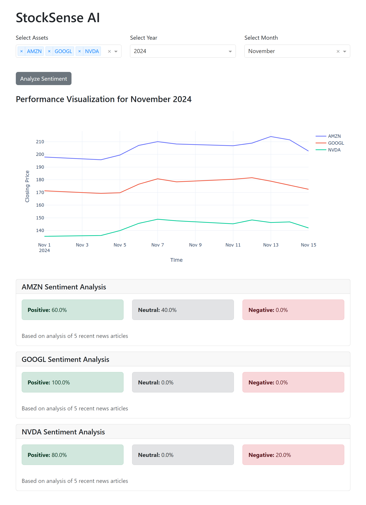

# StockSense AI: Stock Performance & Sentiment Analysis Tool

A stock analysis tool that visualizes stock performance with yfinance and uses Cohere’s generative AI
with NewsApiClient to conduct sentiment analysis on recent news, providing enhanced market insights.

